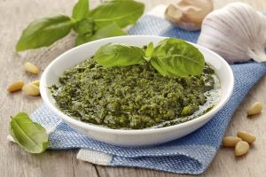

### Pasta al pesto

Pâtes et pesto, l'un des plats de pâtes typiques de l'Italie et l'une des recettes d'été les plus savoureuses qui soient. Il faut bien
l'avouer, le pesto genovese est toujours une fête, mais lorsqu'il est authentique, préparé avec les bons ingrédients et la technique
parfaite, c'est une toute autre histoire. 
Le pesto génois traditionnel est préparé dans un mortier en marbre, où les petites feuilles tendres de basilic génois sont broyées avec de 
l'ail, des pignons de pin, du gros sel et de l'huile d'olive extra vierge. 
N'ayez crainte, il peut également être préparé à l'aide d'un mixeur... l'important est de respecter quelques précautions et de choisir les 
meilleurs ingrédients.

Voilà la recette complète!

#### Ingrédients
- 70 gr de basilique génois 
- 50 gr de _parmesan_
- 30 gr de pignons de pin
- Sel
- 70 gr d'huile d'olive vierge extra

#### Préparation
1. Rincez brièvement les feuilles de basilic à l'eau froide, puis posez-les sur un torchon et faites sécher en les tapotant et en les
   frottant délicatement.
2. Écrasez les pignons, et quand ils sont prêts, faites la même chose pour les feuilles de basilic et le sel.
3. Commencez toujours par des mouvements de percussion et poursuivez par des mouvements de rotation.
4. Lorsque la consistance est crémeuse et homogène, ajouter le parmesan et pilez de la même manière pour l'incorporer.
5. Quand tous les ingrédients ont été réduits en crème, versez l'huile et faites tourner le pilon encore quelques instants.
6. Votre pesto est prêt à être utilisé !

[Retour à la page d'accueil](README.md)

[Recettes des Pouilles](pouilles.md)
