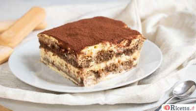

### Tiramisù

Le deuxième plat que je vais vous présenter est le tiramisù, un dessert italien fait avec du café et de la crème fraîche. 
Ce que j'adore particulièrement de ce plat est le nom: litteralement *tiramisu* en italien signifie _fais-moi remonter le moral_.
Effectivement, il suffit de goûter un petit morceaux de ce dessert pour se sentir mieux et retrouver le bonheur!.

Voilà des mots que ma grand-mère me disait tout le temps:
>> Il suffit un peu de sucre pour bien commencer la journée.

Les origines du tiramisù remontent surtout aux régions de la Vénétie et du Frioul-Vénétie-Julienne, au nord-est de l'Italie. 
La légende dit que, en préparant une glace, Roberto Linguanotto aurait laissé tomber du mascarpone dans une jatte contenant un mélange
sucre-oeufs. Séduit par ce mélange, il l’aurait ensuite présenté à Alba, l’épouse d’Ado Campeol, qui aurait ensuite perfectionné la 
recette avec son mari en y ajoutant des biscuits à la cuillère, du café et du cacao.

 Ingrédients       | (Poêle de 20 x 30) 
-------------------|--------------------
750 gr de mascarpon|  120 gr de sucre            
300 gr de café     |  5 oeufs           
Cacao              |  250 gr de savoiardi

#### Préparation
1. Préparez les 300 gr de café dans une _moka_ et laissez refroidir.
2. Divisez très **attentivement** les blancs d'oeufs des jaunes.
3. Montez les jaunes d’œufs avec des fouets électriques, en versant seulement la moitié du sucre.
4. Dès que le mélange est devenu clair et mousseux, et avec les fouets encore en fonction, vous pouvez ajouter lentement le mascarpone.
5. Nettoyez très bien les fouets et passez à fouetter les blancs d’œufs. Quand ils seront mousseux, versez le reste du sucre.
6. Prenez une cuillerée de blancs d’œufs et versez-la dans le bol avec la crème de mascarpone.
7. Mélangez énergiquement avec une spatule.
8. Ensuite, ajoutez le reste des blancs d’œufs, en remuant doucement de bas en haut. La crème au mascarpon est prête.
9. Trempez les _savoiardi_ dans le café froid et créez une base de buiscuits dans la poêle.
10. Ajoutez après la crème au mascarpon et continuez avec les biscuits pour faire deux couches.
11. Quand le tiramisù est complet, ajoutez du cacao.

[Retour à la page d'accueil](README.md)

[Plat suivant: pasta al pesto](pesto.md)
